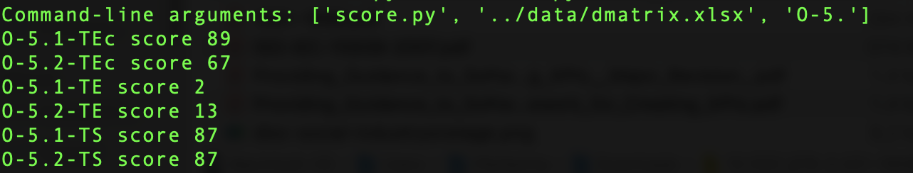

# Software Architecture Assessment for Sustainability: A Case Study


This repository contains the supplementary material to support the paper published at the International Conference on Software Architecture (ECSA) 2024 titled, "Software Architecture Assessment for Sustainability: A Case Study". 
This repository can be used to replicate the study and carry out a Software Architecture Evaluation of other software systems. 

## Repository Structure
This is the root directory of the repository. The directory is structured as follows:

    rep-pkg-sustainable-canvas
     .
     |
     |--- src/		Source code to generate SIS
     |
     |--- docs/		Architecture documentation
     |
     |--- data/		Data used in the paper including templates, input and output data of intermediary steps, and results
           
### Getting started
Here, we provide step-by-step instructions on using this repository, including requirements, and installation/script execution steps.

#### Pre-requisites
- Clone the repository to use it for your project or replication of steps using,
   `git clone https://github.com/iffatfatima/rep-pkg-sustainable-canvas`
- Prioritize QAs
- Document the design decisions using the [DD_Template](data/DD_Template.xlsx), assign QAs to each design option (DO)
- Create a DMatrix for each design option (see [DMatrix](data/dmatrix.xlsx) for example). Detailed instructions are provided in the paper. 

#### Generating a Sustainability Impact Score (SIS)
- Run the following command in [src](src/) folder for all design concerns

  	`python score.py "../data/dmatrix.xlsx" <option-prefix>`

	For example, to get the Sustainability Impact Score (SIS) for all design options for design concern DC-5, use the option prefix "O-5."
	Example command:

	`python score.py "../data/dmatrix.xlsx" "O-5."`

	This will provide the SIS for all options of DC-5 based on the DMatrix.

	Example output:
 
	
- Document the SISs as provided in [results](data/results.xlsx) for observing trade-offs

#### Instatiation of the [Blueprint](https://research.vu.nl/en/publications/towards-a-sustainability-aware-software-architecture-evaluation-f)


| #  | Step                                       | Input                                 | Resource                                                                                                                                                       | Output                                | Resource                                                                                                                                                                                                                                                                                                                           |
| -- | ------------------------------------------ | ------------------------------------- | -------------------------------------------------------------------------------------------------------------------------------------------------------------- | ------------------------------------- | ---------------------------------------------------------------------------------------------------------------------------------------------------------------------------------------------------------------------------------------------------------------------------------------------------------------------------------- |
| 1  | Preparation                                | Information Slide Set                 | [Slides docs/step1-slides.pptx](docs/step1-slides.pptx)                                                                                                                                     | Stakeholders                          | Process director, architects, functional manager, network and traffic personal                                                                                                                                                                                                                                                     |
|    |                                            | Coordination                          | Setting up meeting schedules and emails                                                                                                                        |                                       |                                                                                                                                                                                                                                                                                                                                    |
| 2  | Requirement Identification                 | Stakeholders                          | Process director, architects, functional manager, network and traffic personal                                                                                 | Quality Attributes                    | \- See [docs/Non-functional requirements.pdf]                                                                                                                                                                                                                                                                                      |
|    |                                            | Requirement Documents                 | Confidential                                                                                                                                                   |                                       |                                                                                                                                                                                                                                                                                                                                    |
| 3  | Goal Identification                        | Stakeholders                          | Process director, architects, functional manager, network and traffic personal                                                                                 | Sustainability Goal                   | Sustainability Assessment of Canvas integration at the educational institute. Optimize resource utilization                                                                                                                                                                                                                        |
| 4  | Method Presentation                        | SA Assessment Method Slide Set        | Slides [data/res/step4-slides]                                                                                                                                 | Expectations from stakeholders        | Expectations:<br>\- an internal QA prioritization for reflection<br>\- how can the evaluation help architects define feature requirements for Instructure (the SaaS provider - in this case SaaS is Canvas)<br>\- how can the evaluation help the management define more concrete sustainability requirements for next procurement |
| 5  | Architecture Presentation                  | Architecture documentation            | Some documents are confidential, we only present the final extracted data in [data/Extracted Design Decisions.xlsx]                                            | Sub-set of architecture documentation | \- Some documents are confidential, we only present the final extracted data in [data/Extracted Design Decisions.xlsx]<br>\- See [docs/DecisionDashboard.xlsx]                                                                                                                                                                     |
|    |                                            | Tacit Knowledge                       | Annotated in the original documents, it became part of the final file in [data/Extracted Design Decisions.xlsx] and [docs/arch.pdf]                            |                                       |                                                                                                                                                                                                                                                                                                                                    |
| 6  | Prioritization                             | Quality Attributes                    | Slides [docs/step6-slides]                                                                                                                                     | Prioritized QAs                       | See Sheet "QAs" [data/results.xlsx]                                                                                                                                                                                                                                                                                                |
| 7  | Identification of Architectural Approaches | Sub-set of architectural approaches   | \- Some documents are confidential, we only present the final extracted data in [data/Extracted Design Decisions.xlsx]<br>\- See [docs/DecisionDashboard.xlsx] | Decision Documents                    | See [docs/DecisionDashboard.xlsx]                                                                                                                                                                                                                                                                                                  |
| 8  | Generation of data for analysis            | Decision Documents                    | See [docs/DecisionDashboard.xlsx]                                                                                                                              | Design Decisions and Ratioanle        | See [data/Extracted Design Decisions.xlsx]                                                                                                                                                                                                                                                                                         |
| 9  | Evaluation of obtained data                | Design Decisions and Rationale        | See [data/Extracted Design Decisions.xlsx]                                                                                                                     | Sustainability Impacts and Trade-offs | \- For inter-QA trade-offs, see [data/dmatrix.xlsx]<br>\- For inter-sustainability dimension trade-offs, see Sheet "Trade-offs with SIS" in [data/results.xlsx]                                                                                                                                                                    |
|    |                                            | Prioritized Quality Attribute         | See Sheet "QAs" [data/results.xlsx]                                                                                                                            |                                       |                                                                                                                                                                                                                                                                                                                                    |
|    |                                            | Tacit Knowledge                       | Documented as part of [data/Extracted Design Decisions.xlsx]                                                                                                   |                                       |                                                                                                                                                                                                                                                                                                                                    |
| 10 | Improve and take action                    | Design Decisions and Rationale        | See [data/Extracted Design Decisions.xlsx]                                                                                                                     | Updated design decisions              | See [data/Extracted Design Decisions.xlsx]                                                                                                                                                                                                                                                                                         |
|    |                                            | Prioritized Quality Attribute         | See Sheet "QAs" [data/results.xlsx]                                                                                                                            |                                       |                                                                                                                                                                                                                                                                                                                                    |
|    |                                            | Sustainability Impacts and Trade-offs | \- DMatrix, see [data/dmatrix.xlsx]<br>\- Sheet "Trade-offs with SIS" in [data/results.xlsx]                                                                   |                                       |                                                                                                                                                                                                                                                                                                                                    |
| 11 | Presentation of results                    | All inputs and outputs                | All resources                                                                                                                                                  | Evaluation Report                     | Paper                                                                                                                                                                                                                                                                                                                              |


### How to cite this work
```
@inproceedings{ecsa-2024-SA-assess-sus,
  title={{Software Architecture Assessment for Sustainability: A Case Study}},
  author={Iffat Fatima and Patricia Lago},
  booktitle={Software Architecture},
  publisher={Springer Nature Switzerland},
  year={2024}
}
```
